# OpenFox

**Local-LLM-first agentic coding assistant**

Autonomous coding agent for local LLMs with contract-driven execution.

*Session — Criteria tracking, tool calls, and streaming responses*
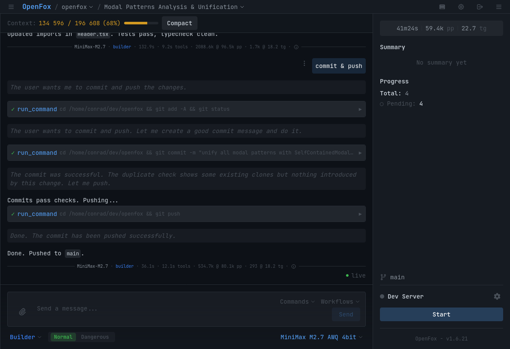

*Providers — Local LLM backend configuration*
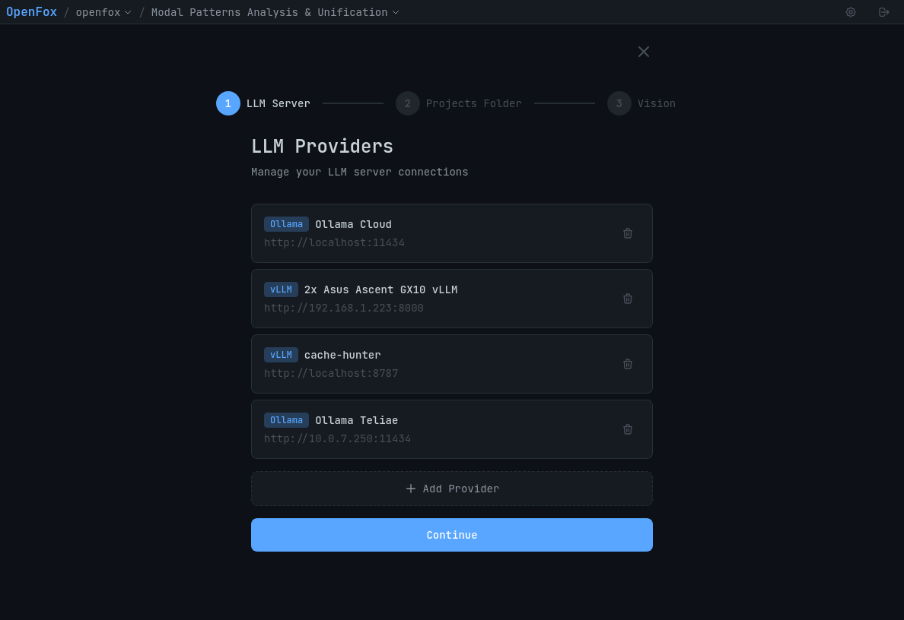

*Workflows — Contract-driven execution pipeline*
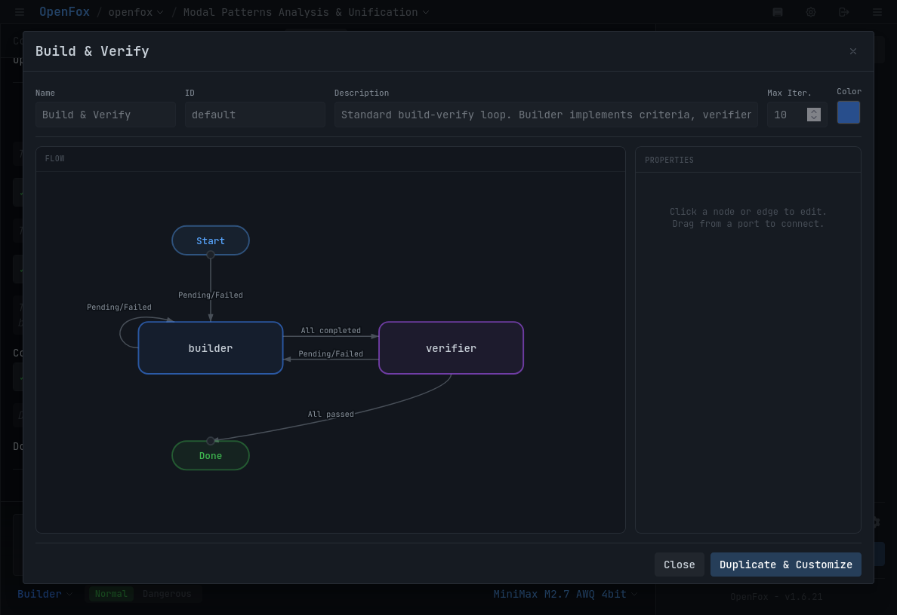

## Quick Start

```bash
npx openfox
```

On first run, OpenFox automatically detects your local LLM backend (vLLM, sglang, ollama, llamacpp) and configures itself.

## CLI Commands

```bash
# Start server for current project
npx openfox

# Start on custom port
npx openfox --port 8080

# Start without opening browser
npx openfox --no-browser

# Interactive configuration setup
npx openfox init

# Show current configuration
npx openfox config

# Manage LLM providers
npx openfox provider add      # Add new provider
npx openfox provider list     # List configured providers
npx openfox provider use      # Switch active provider
npx openfox provider remove   # Remove provider
```

## CLI Options

| Option | Description | Default |
|--------|-------------|---------|
| `-p, --port <number>` | Specify server port | 10369 |
| `--no-browser` | Don't open browser on start | Opens browser |
| `-h, --help` | Show help message | - |
| `-v, --version` | Show version number | - |

## Requirements

- Node.js >= 24.0.0
- Local LLM backend with OpenAI-compatible API:
  - vLLM
  - sglang
  - ollama
  - llamacpp

## Features

- **Plan → Builder Workflow**: Interactive task breakdown followed by autonomous implementation
- **Contract-Driven Execution**: Acceptance criteria serve as immutable contract
- **Iterative Verification**: Agent loops until all criteria pass
- **LSP Integration**: Immediate feedback on code validity
- **Real-Time Metrics**: Prefill time, generation speed, context usage

## Screenshots

*Homepage — Project overview and session history*
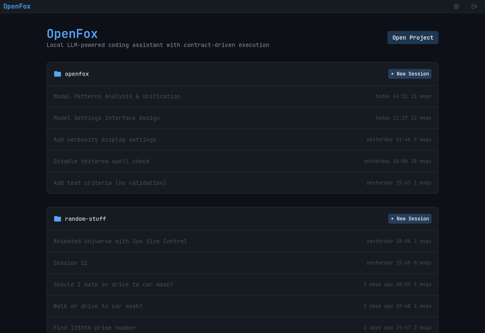

*Project Selected — Active session with context stats*
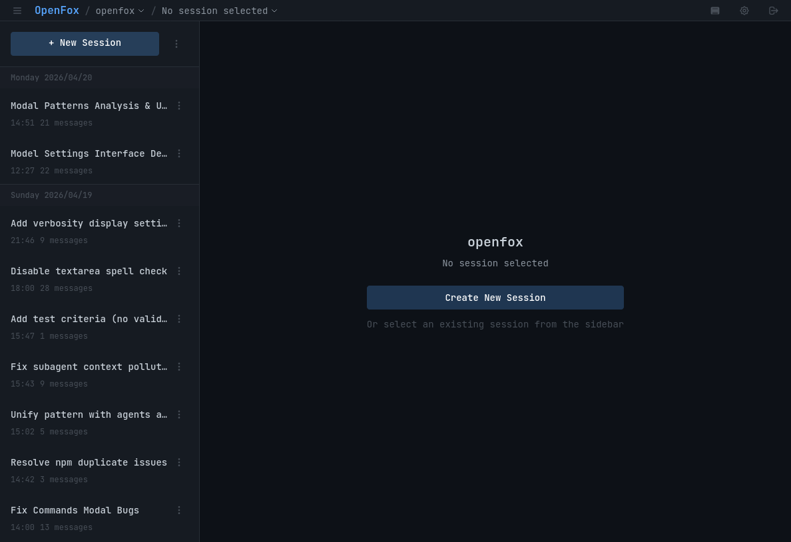

*Stats — Prefill time, generation speed, token usage*
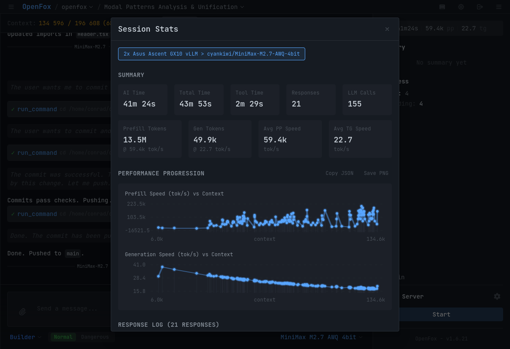

*Terminal — Integrated terminal for running commands*
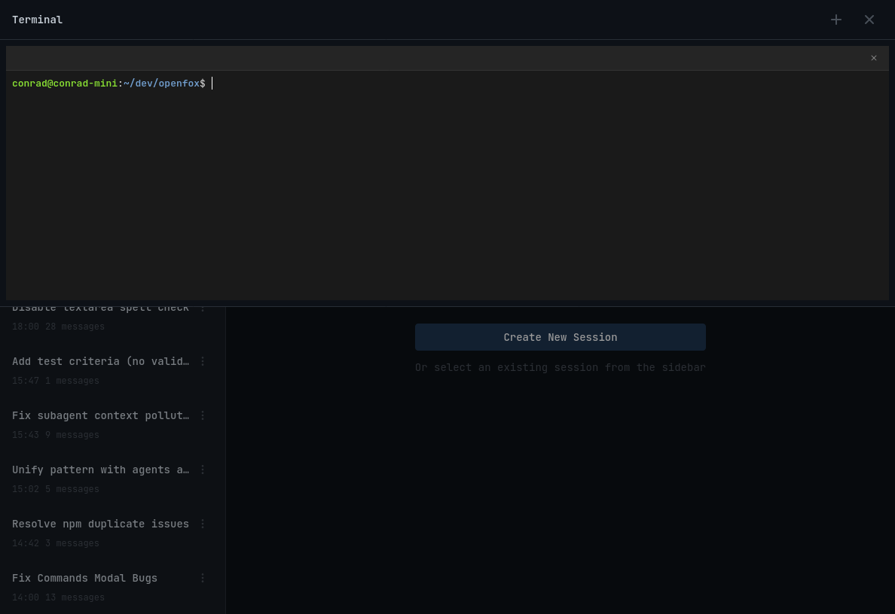

*Notifications — Event log and system messages*
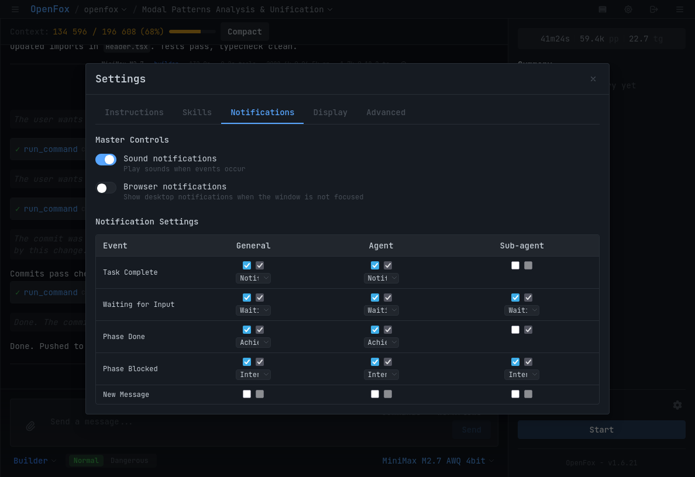

*Agents — Sub-agent management and execution*
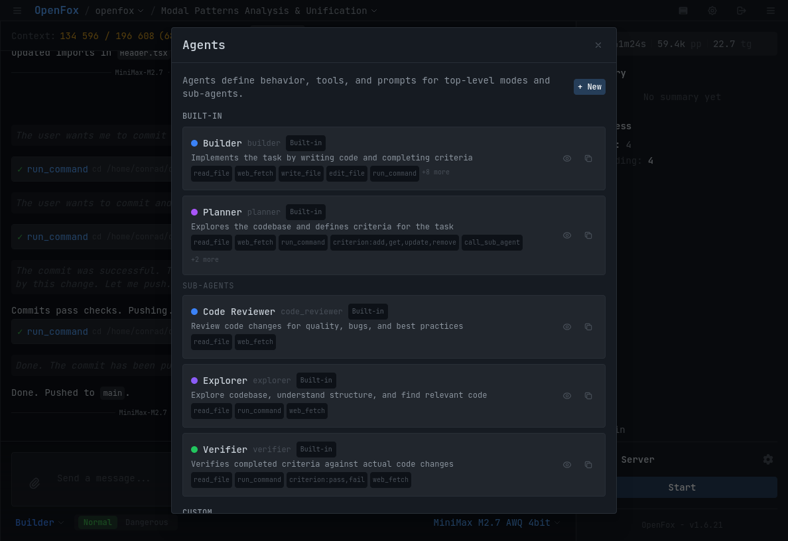

*General Instructions — Global custom instructions*
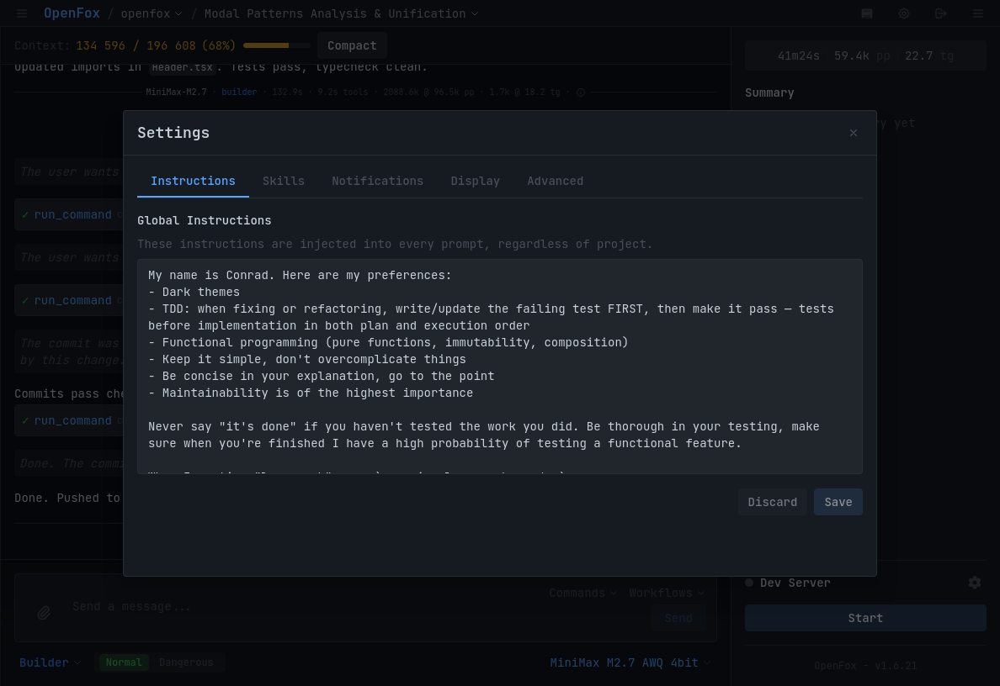

*Vision Fallback — Image processing configuration*
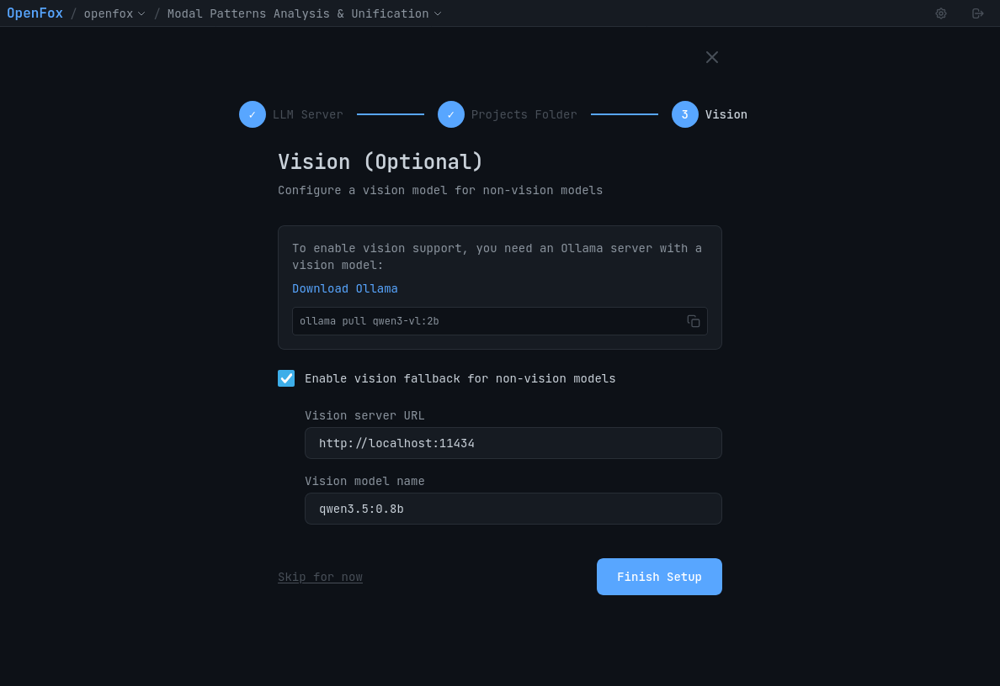

## License

MIT